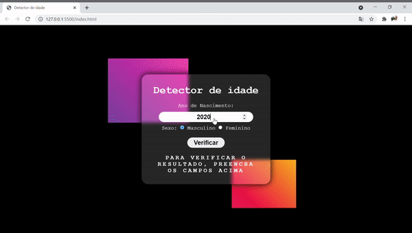

# 
 Detector de Idade 

  

## About:
Application created to put all knowlegde into practice about first concepts with JavaScript, by watching Curso em Video Youtbe Channel.

When you type the birth of year and choose gender, the application will display the current age with a funny picture, demostrating the appearance according to age.

In case of age like zero or beyond currently year, a pop-up will appear to inform there's wrong informations.

## Check out the website:
https://juniormacedo91.github.io/age-detector/

## Techniques:

 - [x] DOM - Document Object Model - It represents the webpage in connection with JavaScript;
 - [x] Alert - An information pop-up box;
 - [x] createElement - Creat an HTML element through JavaScript;
 - [x] setAttribute - Set an attribute or change the currently value;

## Skills:

